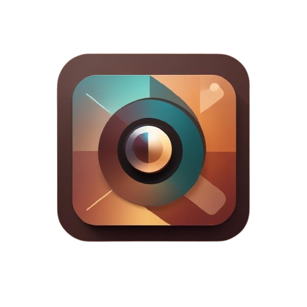
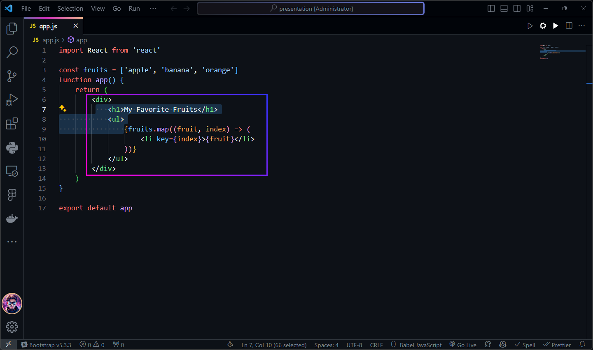

# 🎉 **Presentee** - The Ultimate Section Highlighter for Presentations 🚀



## ✨ **Overview**

Welcome to **Presentee**, the must-have app for anyone who delivers presentations! Whether you're giving a lecture, a business pitch, or simply showcasing your ideas, **Presentee** lets you **highlight sections** of your content with ease—on **Windows** and **Linux**.

Say goodbye to messy annotations or clunky tools. With **Presentee**, you can focus on what really matters: delivering your message effectively.

## 🏆 **Features**

- **Cross-Platform**: Works seamlessly on both **Windows** and **Linux**. 🌍
- **Clean & Minimalist**: A modern design that doesn’t distract from your presentation.
- **Highlight Sections**: Effortlessly highlight key points or sections during your presentation.
- **User-Friendly**: Simple, intuitive controls for smooth operation.

## 💻 **Installation**

Getting started with **Presentee** is a breeze! Follow the steps below to install it on your system.

### On Windows:

1. Download the latest **Presentee** installer for Windows.
2. Run the installer and follow the instructions.
3. Launch **Presentee** and start highlighting!

### On Linux:

1. Download the latest **Presentee** `.deb` package.
2. Install the package using your package manager:
   ```bash
   sudo dpkg -i presentee.deb
   ```
3. Open **Presentee** and start highlighting!

## 🎯 **Usage**

1. **Open** your presentation.
2. **Start Presentee**.
3. **Highlight** sections with a click or hotkey.
4. **Present** your content like a pro!

## 📸 **Screenshots**



## ⚙️ **Development**

Want to contribute? **Presentee** is open source! Here's how you can get started:

1. Clone the repo:
   ```bash
   git clone https://github.com/thamidu-nadun/presentee.git
   cd presentee
   ```
2. Install dependencies:
   ```bash
   npm install
   ```
3. Start the app in development mode:
   ```bash
   npm start
   ```

Feel free to open issues or submit pull requests for improvements!

## 🚀 **License**

**Presentee** is licensed under the [MIT License](LICENSE).

---
